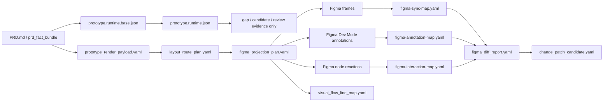

# Prototype Projection Harness 2.1 Stage Rules Detailed

本文档用于把 `prototype_projection_harness` 的每个 stage 展开到可执行、可审阅、可排查的颗粒度。

本文档不是新的实现逻辑；它是对当前 2.1 规则的详细说明。规则来源以 PRD-first 修复 worktree 中的 prototype harness contract 为准：

- `sub_harnesses/prototype_projection_harness/harness_contract.yaml`
- `sub_harnesses/prototype_projection_harness/runtime_generation_rules.yaml`
- `sub_harnesses/prototype_projection_harness/runtime_inference_policy.yaml`
- `sub_harnesses/prototype_projection_harness/renderer_stage_plan.yaml`
- `sub_harnesses/prototype_projection_harness/figma_projection_rules.yaml`
- `sub_harnesses/prototype_projection_harness/interaction_projection_rules.yaml`
- `sub_harnesses/prototype_projection_harness/figma_reaction_mapping.yaml`
- `sub_harnesses/prototype_projection_harness/figma_comment_annotation_policy.yaml`
- `sub_harnesses/prototype_projection_harness/layout_routing_coupling_rules.yaml`
- `sub_harnesses/prototype_projection_harness/pen_line_routing_rules.yaml`
- `sub_harnesses/prototype_projection_harness/component_binding_policy.yaml`
- `sub_harnesses/prototype_projection_harness/pattern_projection_rules.yaml`
- `sub_harnesses/prototype_projection_harness/uxwriter_stage_rules.yaml`
- `sub_harnesses/prototype_projection_harness/renderer_skill_hook_policy.yaml`
- `sub_harnesses/prototype_projection_harness/figma_diff_policy.yaml`
- `sub_harnesses/prototype_projection_harness/reverse_sync_policy.yaml`
- `sub_harnesses/prototype_projection_harness/validators.yaml`

## 0. Check Findings

当前应采用的 2.1 规则结论如下：

1. Renderer 默认必须是 PRD-first / fact-bundle-first。
   `prototype.runtime.json` 不是默认渲染事实源，只能作为 validation、gap、candidate、review evidence。

2. Figma 中的“备注”必须是 Dev Mode annotations。
   目标 API 是 `node.annotations / labelMarkdown`；不是 REST comments，不是画布上的说明卡片，也不是 side panel note。

3. Figma behavior、annotation、visual line 三者必须分离。
   `node.reactions` 是真实可交互行为；annotation 是交互说明；visual pen line 只是流程文档。

4. Harness audit / memory / candidate review artifact 不能进入产品主画布。
   例如 `HARNESS_MAP_AND_MEMORY_RECORDS`、`HARNESS_REVIEW_COMMENTS_CANDIDATE_ONLY` 只能落到本地记录、projection report、hidden review page 或单独 audit page。

5. 主工作区 v2.1 里曾有历史命名漂移。
   `RND-06` 的旧名可能还残留 `comments / figma-comment-map`。2.1 正确语义是 `figma-annotation-map`；`figma-comment-map` 只能作为 deprecated alias。

## 1. Core Pipeline



### Global Authority Boundary

| Area | Rule |
| --- | --- |
| Fact authority | `prd_fact_bundle` / owner harness fact stores |
| Render authority | `prototype_render_payload.yaml` |
| Runtime authority | Derived projection intermediate only |
| Figma authority | Visual/prototype projection only, not PRD fact source |
| Reverse sync authority | Candidate generation only |
| Human review | Required before semantic/high-risk fact change |

### Owned By Prototype Harness

- `prototype_render_payload`
- `prototype_runtime_model`
- `runtime_reasoning_completion`
- `renderer_stage_plan`
- `layout_route_plan`
- `component_binding`
- `pattern_binding`
- `uxwriter_copy_projection`
- `figma_forward_projection`
- `figma_node_map`
- `figma_interaction_map`
- `figma_annotation_map`
- `visual_flow_line_map`
- `renderer_skill_influence_trace`
- `figma_diff_ingest`
- `prototype_projection_reports`

### Not Owned By Prototype Harness

- confirmed product requirements
- screen fact store
- metric/event fact store
- `PRD.md`
- human approval of patch
- Figma design system source components

### Forbidden Direct Writes

- `product-spec/requirements.yaml`
- `product-spec/screens.yaml`
- `product-spec/metrics.yaml`
- `product-spec/events.yaml`
- `product-spec/PRD.md`

## 2. Stage RUN-00: Isolated Prototype Run Setup

### Purpose

创建隔离运行环境，让单次 prototype run 不污染主工程、主 fact store、旧 Figma maps 或其他 harness 输出。

### Inputs

- source PRD or `prd_fact_bundle`
- target Figma file / page / node scope
- current prototype harness rules
- optional previous `figma-sync-map.yaml`
- optional previous `figma-interaction-map.yaml`
- optional previous `figma-annotation-map.yaml`

### Outputs

- isolated run directory
- frozen input copy
- run manifest
- output namespace for this run
- local projection reports

### Required Rules

- 每次真实 run 必须有独立 run id。
- 输入 PRD 必须复制到隔离目录，不能在原路径上写回。
- 所有 generated artifact 必须写入本 run 的 `io/output`、`io/state` 或 report 目录。
- 可以读取已有 maps 作为 diff base，但不能原地覆盖旧 maps，除非 run 被明确提升为 accepted projection。
- 不允许在 run 过程中修改其他 sub-harness 的 fact store。

### Blocks If

- run directory 与已有 run 混用。
- 输出路径指向主 fact store。
- target Figma scope 不清楚，导致可能覆盖设计师已有区域。
- previous maps 与当前 target Figma file 不匹配。

### Evidence

- run id
- input hash
- output directory
- Figma target file/page/node id
- previous map hash

## 3. Stage FACT-01: PRD Fact Bundle Validation

### Purpose

确认 renderer 消费的是结构化、可追踪的 product facts，而不是自由文本推理结果。

### Inputs

- `prd_fact_bundle.yaml`
- `requirements.yaml`
- `screens.yaml`
- `metrics.yaml`
- `events.yaml`
- `traceability.md`
- `component-binding-map.yaml`
- `design-semantic-library.json`

### Outputs

- fact bundle validation report
- source snapshot
- unresolved fact gaps

### Required Rules

- 每条 requirement、screen、state、event、metric 都必须有稳定 id。
- 每个可渲染对象必须能追溯到 source refs。
- PRD prose 可以作为 extraction input，但渲染阶段必须消费 typed facts。
- 如果没有结构化 fact bundle，必须先生成 typed payload，并把来源段落记录为 `source_refs`。

### Forbidden

- 把 PRD 段落直接当 Figma layer text 大量铺到画布上。
- 把无 source refs 的 LLM 总结当事实。
- 把 Figma layer name 当事实来源。

### Blocks If

- screen 缺少 state。
- interaction 缺 trigger 或 destination。
- metric/event 缺 owner 或 usage context。
- source refs 为空。

### Related Validators

- `PROTO-RUNTIME-001`
- `PROTO-RENDER-005`
- `PROTO-RENDER-006`

## 4. Stage PAYLOAD-01: Compile Prototype Render Payload

### Purpose

把 PRD facts 编译为 renderer 可以直接消费的 typed payload，避免 renderer 在画图时临场推理产品逻辑。

### Inputs

- `prd_fact_bundle.yaml`
- `component-binding-map.yaml`
- `design-semantic-library.json`
- optional runtime gap evidence

### Outputs

- `prototype-render-payload.yaml`

### Required Payload Shape

`prototype_render_payload` 至少应保留：

- screen ids
- state ids
- component ids
- component semantic role
- user-visible copy refs
- interaction ids
- edge ids
- trigger type
- guard/precondition
- ordered actions
- destination or state effect
- annotation body
- source refs
- render eligibility
- candidate/inferred marker

### Required Rules

- renderer 只能渲染 `render_eligibility: renderable` 且有 source refs 的内容。
- inferred/candidate/gap 内容默认不可进入产品画布。
- user-visible text 必须来自 PRD facts 或 copy catalog，不能由 renderer 临时编。
- trigger type 必须保真，不允许为了好画而改成 button。

### Forbidden

- 在 payload 中把多个状态压成一个 generic card。
- 在 payload 中把 `ON_DRAG` 改写为 `ON_CLICK`。
- 在 payload 中把 `AFTER_TIMEOUT` 改写为 demo button。
- 在 payload 中丢弃 `edge_id`、`source_refs`、`guard`。

### Blocks If

- rendered node、label、edge 缺 source refs。
- candidate/inferred 内容标为 renderable。
- copy 没有来源。
- edge 没有 `edge_id`。
- trigger/action/destination 不完整。

### Related Validators

- `PROTO-RENDER-005`
- `PROTO-RENDER-006`
- `PROTO-INTERACTION-004`

## 5. Stage RT-01: Base Runtime Generation

### Purpose

从 PRD fact bundle 直接生成 `prototype.runtime.base.json`。这是机械投射，不做产品逻辑补全。

### Inputs

- `prd_fact_bundle`
- `component-binding-map.yaml`
- `design-semantic-library.json`

### Outputs

- `prototype.runtime.base.json`
- `generation_lineage.pass_1`
- initial `prototype_gaps`

### Allowed Operations

- normalize ids
- resolve screen to screen-state candidates
- copy existing requirement refs
- copy acceptance refs
- map declared components
- map declared events
- preserve PRD traceability

### Forbidden Operations

- inventing new requirements
- inventing business rules
- changing copy tone
- selecting visual layout route
- silently completing missing states

### Required Sections

- `prototype_runtime_version`
- `authority`
- `source_snapshot`
- `generation_lineage`
- `flows`
- `screens`
- `overlays`
- `variables`
- `component_bindings`
- `copy_catalog`
- `interaction_graph`
- `prototype_gaps`

### Blocks If

- no source snapshot
- no generation lineage
- unstable semantic ids
- Figma node id used as semantic id
- missing screen/state/edge source refs

### Related Validators

- `PROTO-RUNTIME-001`
- `PROTO-RUNTIME-002`

### Patch Contract

- `PROTO-008`

## 6. Stage RT-02: Runtime Reasoning Completion

### Purpose

生成可审阅的状态、交互、copy candidate 和缺口，不直接进入产品画布。

### Inputs

- `prototype.runtime.base.json`
- `prd_fact_bundle`
- state dimension profile
- interaction completion rules
- optional UX writer output

### Outputs

- `prototype.runtime.json`
- `prototype_runtime_reasoning_report.yaml`
- `reasoning_completion.inferred_states`
- `reasoning_completion.inferred_interactions`
- `reasoning_completion.blocked_inferences`
- `prototype_gaps`

### Allowed Operations

- complete missing screen-state dimensions when supported
- infer standard loading/empty/error/success states when grounded
- expand branches from acceptance criteria
- add recovery paths for declared failure outcomes
- mark ambiguous states as gaps
- generate copy candidates before UX writer finalization
- attach `inference_confidence`
- attach `inference_basis`

### Forbidden Operations

- silently convert inferred branch into confirmed fact
- silently convert inferred branch into renderable product UI
- delete PRD-declared branches
- hide unresolved conflicts
- collapse business state into component variant when the state affects screen-level behavior

### Required State Dimensions

- data state
- network state
- permission state
- input state
- request lifecycle
- consistency state
- recovery state
- platform/device state
- empty state
- error state
- loading state
- success state

### Required Interaction Fields

- source screen state
- source component or hotspot
- trigger
- guard or precondition
- ordered actions
- destination or state effect
- fallback or gap
- analytics event or no-event reason
- source refs

### Blocks If

- inferred item lacks `inference_basis`
- inferred item lacks confidence
- inferred item lacks source refs
- screen state misses required dimension without explicit `not_applicable`
- runtime inferred content is marked as product renderable without review

### Related Validators

- `PROTO-RUNTIME-003`
- `PROTO-RUNTIME-004`
- `PROTO-RUNTIME-005`

### Patch Contract

- `PROTO-012`

## 7. Stage RND-00: Input Freeze And Hash

### Purpose

冻结本次渲染输入，防止 page render、annotation、reaction、line routing 使用不同版本的 facts。

### Inputs

- `prototype_render_payload.yaml`
- frozen `prd_fact_bundle`
- optional `prototype.runtime.json` as gap evidence
- `uxwriter-copy-catalog.yaml`
- component bindings
- optional renderer skill pack

### Outputs

- `io/state/render_input.lock.yaml`

### Required Rules

- 所有输入必须记录 path、hash、timestamp、run id。
- 后续 stage 只能读取 lock 中声明的输入版本。
- strict runtime mode 只影响 runtime 完整性检查，不把 runtime 提升为渲染事实源。

### Blocks If

- render payload validation fails
- strict runtime validation fails when requested
- UX writer validation fails
- source refs missing
- hash mismatch between lock and actual input

### Related Validators

- `PROTO-RENDER-005`
- `PROTO-RENDER-006`
- `PROTO-UXW-001`

## 8. Stage RND-01: Global Layout And Route Blueprint

### Purpose

先规划全局画布、页面间距、状态栈、overlay lane、annotation target、route corridor，再画具体页面。

### Inputs

- frozen render payload
- screen sequence
- interaction graph
- state list
- overlay list
- annotation requirements
- route density budget

### Outputs

- `layout_route_plan.yaml`

### Layout Model

- flow section
- sequence group
- screen cluster
- state stack
- overlay lane
- annotation lane
- interaction spec lane
- route corridor
- harness audit page

### Default Numeric Rules

- frame width: `390`
- frame height: `844`
- screen gap x: `360`
- min frame gap x: `160`
- min frame gap y: `120`
- state gap y: `140`
- sequence gap x: `520`
- flow gap y: `520`
- overlay lane gap x: `260`
- annotation lane width: `280`
- route corridor width: `160`
- line spacing: `18`
- edge label gap: `8`

### Placement Rules

- happy path uses left-to-right primary row.
- same-screen states use vertical state stack.
- state order is default, loading, empty, input_invalid, submitting, success, failed, recovery.
- overlays sit in right overlay lane near source screen.
- errors/recovery sit below primary state or in error lane.
- annotations attach to Dev Mode nodes, with summary lane only when dense.
- harness audit artifacts must be in separate audit page or local artifact only.

### Route Corridor Rules

- corridors must be reserved before frame render.
- primary horizontal routes before vertical state routes.
- overlay short routes before recovery/cross-flow.
- max crossings per edge: `2`.
- crossings through frames are forbidden.
- if line density exceeds budget, merge, bundle, collapse, or draw only primary edge.

### Blocks If

- page detail render starts before layout plan exists.
- frames are too close.
- route corridor is missing.
- annotations block touch targets.
- audit artifacts are inside product flow.

### Related Validators

- `PROTO-RENDER-001`
- `PROTO-LAYOUT-001`
- `PROTO-LAYOUT-002`
- `PROTO-LINE-003`

### Patch Contract

- `PROTO-013`
- `PROTO-016`

## 9. Stage RND-02: Full Canvas Skeleton

### Purpose

创建完整 Figma skeleton：sections、flow containers、screen frame placeholders、state frames、overlay placeholders、annotation target lanes、route lanes。

### Inputs

- `layout_route_plan.yaml`
- frozen render payload
- Figma target page/scope

### Outputs

- `figma_projection_plan.stage_02_skeleton.yaml`
- initial `figma-sync-map.yaml`

### Required Operations

- create Figma page or section
- create flow section
- create screen frame placeholder
- create state frame placeholder
- create overlay placeholder
- create interaction spec placeholder
- reserve route corridor nodes
- reserve annotation target nodes or target zones

### Required Rules

- skeleton must include all screen/state/overlay placeholders before detail render.
- product canvas and audit canvas must be separated.
- each managed placeholder needs semantic metadata.
- every frame has explicit x, y, width, height.

### Forbidden

- drawing detailed UI before skeleton is complete.
- placing harness memory/candidate records in product canvas.
- using visible product cards to explain harness internals.

### Blocks If

- screen/state/overlay count in skeleton differs from render payload.
- missing managed metadata.
- missing route/annotation reserved zone.
- audit/memory nodes appear in product flow.

### Related Validators

- `PROTO-RENDER-002`
- `PROTO-LAYOUT-002`
- `PROTO-FIGMA-001`

## 10. Stage RND-03: Sequence Group Page Render

### Purpose

按 sequence group 渲染页面细节，确保主流程、异常状态和分支状态完整且可读。

### Inputs

- skeleton
- render payload
- layout route plan
- component binding policy
- pattern projection rules
- copy catalog

### Outputs

- `figma_projection_plan.stage_03_pages.yaml`
- updated `figma-sync-map.yaml`

### Preferred Render Order

1. happy path primary sequence
2. blocking modals
3. error and recovery states
4. empty, loading, permission states
5. secondary branches

### Required Rules

- 每个 screen state 必须有独立可识别区域或 frame。
- screen-level business states use frames.
- component internal states use variants.
- dynamic minor states may use variables.
- logical explanation text must not become product UI copy.
- renderer may show product UI, not harness reasoning.

### Forbidden

- 把“为什么这么做”的说明直接画进用户页面。
- 用一个页面卡片替代多个状态。
- 把 candidate/gap 当成用户可见功能。
- 在页面上新增 PRD 未声明的产品逻辑。

### Blocks If

- required state missing.
- state rendered but lacks source refs.
- page UI contains unapproved inferred content.
- business state collapsed into component-only state incorrectly.

### Related Validators

- `PROTO-RENDER-004`
- `PROTO-RENDER-006`
- `PROTO-RUNTIME-004`

## 11. Stage RND-04: Component And Pattern Fill

### Purpose

把 semantic components 和 screen patterns 绑定到 Figma component、template、semantic library composition 或 fallback placeholder。

### Inputs

- rendered page skeleton
- component binding map
- design semantic library
- pattern rules
- render payload component list

### Outputs

- `component_binding_resolution_report.yaml`
- component binding gaps
- updated `figma-sync-map.yaml`

### Component Resolution Priority

1. existing Figma component
2. existing Figma pattern or template
3. design semantic library composition
4. low-fi placeholder with gap

### Matching Keys

- semantic key
- semantic role
- required props
- state kind
- component key
- component name
- variant properties
- component properties

### Variant Rules

- button states: enabled, disabled, loading, pressed
- input states: empty, focused, filled, error, disabled
- intent values: primary, secondary, danger, neutral

### Prop Override Allowed

- label
- placeholder
- value
- icon
- width

### Semantic Locked Fields

- semantic role
- interaction destination
- source refs
- requirement refs

### Blocks If

- required prop slot missing.
- component role changed without candidate.
- button/link replacement happens without candidate.
- primary/secondary intent change happens without candidate.
- required variant missing and no review-required gap is created.

### Related Validators

- `PROTO-COMP-001`
- `PROTO-COMP-002`
- `PROTO-COMP-003`

### Patch Contract

- `PROTO-009`

## 12. Stage RND-05: UX Writer Copy Application

### Purpose

把经过 UX writer 规则校验的 copy catalog 应用到 Figma text layers，同时不改变产品事实。

### Inputs

- runtime copy candidates
- render payload text refs
- screen purpose
- state kind
- component semantic role
- user goal
- error/recovery context
- locale
- brand voice profile
- optional skill pack tone hints

### Outputs

- `uxwriter-copy-catalog.yaml`
- `copy_application_report.yaml`
- updated text node bindings

### Authority Rules

- UX writer may rewrite user-visible copy.
- UX writer may not change product behavior.
- UX writer may emit PRD patch candidate for missing copy intent.
- `original_copy_ref` is required.
- `rewrite_reason` is required.
- `locale` is required.

### UX Dimensions

- task fit
- readability
- cognitive load
- consistency
- warmth and humanity
- actionability
- contextuality
- error recovery
- trust and truthfulness
- accessibility
- localization
- scannability
- progressive disclosure
- button specificity
- empty-state usefulness
- feedback brevity
- destructive clarity
- emotional calibration
- terminology governance
- data/privacy sensitivity

### zh-CN Length Defaults

- primary button: max 8 chars
- secondary button: max 10 chars
- toast: max 28 chars
- inline error: max 34 chars
- page title: max 18 chars
- empty state title: max 16 chars
- empty state body: max 60 chars
- modal title: max 18 chars
- modal body: max 90 chars

### Forbidden Copy

- generic blame: `你错了`, `无效操作`, `非法`
- generic machine text: `系统异常`, `发生未知错误`, `请稍后`
- vague CTA: `提交`, `确定`, `处理`, `完成` unless context fully disambiguates
- unsourced demo labels such as `演示 OCR 失败`

### Human Review Required For

- legal or policy copy
- payment or privacy copy
- destructive action copy
- health or safety sensitive copy
- brand voice exception

### Blocks If

- copy catalog fails schema.
- user-visible copy lacks source refs.
- critical flow copy fails UXW validators.
- destructive/privacy/payment copy lacks human review.
- renderer invents copy absent from PRD/copy catalog.

### Related Validators

- `PROTO-UXW-001`
- `PROTO-UXW-002`
- `PROTO-UXW-003`

### Patch Contract

- `PROTO-015`

## 13. Stage RND-06: Figma Dev Mode Annotations

### Purpose

把交互、状态、guard、gap、evidence 写成 Figma Dev Mode annotations，绑定到真实源节点或区域。

### Inputs

- render payload interactions
- annotation-required flags
- layout route plan
- Figma node map
- interaction source nodes
- gap evidence

### Outputs

- `figma-annotation-map.yaml`
- optional deprecated `figma-comment-map.yaml` alias

### Annotation Categories

- Interaction
- State
- Guard
- Gap
- Evidence

### Target Resolution Order

1. exact component instance node
2. slider thumb or track node
3. generated gesture region node
4. source state frame node
5. affected frame or component node

### Forbidden Targets

- side panel note
- canvas comment card
- REST comment thread
- harness audit panel

### Required Interaction Annotation Body

Must include:

- interaction id
- trigger
- guard or precondition
- ordered actions summary
- else actions summary when applicable
- state effect
- analytics event or none
- source refs

### Required State Annotation Body

Must include:

- state id
- entry condition
- exit condition
- recovery path or none
- source refs

### Required Gap Annotation Body

Must include:

- gap id
- missing decision
- blocking reason
- suggested question
- owner candidate

### Density Rules

- max annotations per screen state: `8`
- max annotations per component: `2`
- overflow collapses to interaction spec panel plus one Dev Mode summary annotation.
- duplicate semantic annotation uses one annotation with `applies_to_state_list`.

### Blocks If

- required annotation map entry is missing.
- annotation is not anchored to source component/hotspot/frame region.
- annotation body lacks trigger/guard/actions/effect/event/refs.
- side-panel note or canvas card is used as substitute.

### Related Validators

- `PROTO-ANNOTATION-001`
- `PROTO-ANNOTATION-002`
- `PROTO-ANNOTATION-003`
- `PROTO-ANNOTATION-004`
- `PROTO-INTERACTION-007`

### Patch Contract

- `PROTO-014`

## 14. Stage RND-07: Real Prototype Reactions

### Purpose

写入真实 Figma `node.reactions`，让 prototype 可以点击、拖动、定时跳转、打开 overlay、切换 variant 或设置 variable。

### Inputs

- `prototype_render_payload.interactions`
- Figma source node map
- Figma destination node map
- annotation map
- component variant map
- variable map

### Outputs

- `figma-interaction-map.yaml`
- Figma `node.reactions`

### Action Mapping

| Semantic action | Figma action |
| --- | --- |
| `NAVIGATE` | `NODE` + `NAVIGATE` |
| `OPEN_OVERLAY` | `NODE` + `OVERLAY` |
| `SWAP_OVERLAY` | `NODE` + `SWAP` |
| `CLOSE_OVERLAY` | `NODE` + `CLOSE` |
| `BACK` | `NODE` + `BACK` |
| `SCROLL_TO` | `NODE` + `SCROLL_TO` |
| `CHANGE_VARIANT` | `NODE` + `CHANGE_TO` |
| `SET_VARIABLE` | `SET_VARIABLE` |
| `CONDITIONAL` | `CONDITIONAL` |
| `OPEN_URL` | `URL` |
| `NO_OP_ANNOTATION` | No reaction; annotation only |

### Trigger Fidelity Rules

- `ON_CLICK` binds only to real click/tap controls.
- `ON_DRAG` binds only to slider thumb, slider track, drag handle or gesture region.
- `AFTER_TIMEOUT` binds to frame-level timed reaction.
- Same source + same trigger must merge as conditional or block.
- Multiple triggers per source are allowed if triggers differ.

### Action Order Rules

- Preserve runtime order.
- Require explicit order.
- Set variable before navigation.
- Open overlay before delayed navigation.

### Conditional Rules

- Use Figma conditional only when guard expression and variables are resolvable.
- Otherwise split into explicit state frames.
- If ambiguous, emit gap.
- Branch annotation is required.

### Overlay Rules

- Modal open requires close path.
- Destructive modal requires cancel.
- Toast requires dismiss strategy.
- Toast default auto-dismiss is `2500ms`.

### Forbidden

- `ON_DRAG` rendered as button.
- `AFTER_TIMEOUT` rendered as demo button.
- Visual line used as clickable behavior.
- Unsupported action faked without gap.
- Duplicate same-source same-trigger independent reactions.

### Blocks If

- source node missing and no blocking gap.
- destination node missing.
- edge id missing.
- reaction action missing.
- duplicate trigger unresolved.
- modal lacks close/cancel path.
- toast lacks dismiss.
- reaction map round trip does not match interaction graph.

### Related Validators

- `PROTO-INTERACTION-001`
- `PROTO-INTERACTION-002`
- `PROTO-INTERACTION-003`
- `PROTO-INTERACTION-004`
- `PROTO-INTERACTION-005`
- `PROTO-INTERACTION-006`
- `PROTO-INTERACTION-008`
- `PROTO-INTERACTION-009`

### Patch Contract

- `PROTO-011`

## 15. Stage RND-08: Visual Pen-Line Flow Documentation

### Purpose

绘制说明用 flow lines。它们帮助评审理解流程，但不是交互行为来源。

### Inputs

- layout route plan
- interaction map
- annotation map
- visual line routing rules
- design semantic library tokens

### Outputs

- `visual_flow_line_map.yaml`
- optional Figma line/vector nodes

### Line Authority Rules

- visual lines are documentation only.
- reaction map is authoritative for clickable behavior.
- line edit in Figma does not modify runtime.
- visual-only line changes are Figma-only unless annotation/reaction changes semantic logic.

### Line Types

- primary navigation
- conditional branch
- state transition
- overlay open
- recovery or cancel
- external or cross-flow

### Routing Algorithm

1. classify edge type and priority
2. assign corridor from layout route plan
3. allocate lane index inside corridor
4. offset parallel edges by lane index times line spacing
5. dedupe or merge edges that violate duplicate trigger policy
6. emit line nodes and labels

### Anchor Rules

- source component edge closest to destination
- generated hotspot edge
- screen frame right edge
- screen frame bottom edge for error/recovery
- destination frame left edge
- overlay frame left edge
- state frame top edge
- gateway node center
- self transition uses loopback stub

### Overlap Rules

- same source + same trigger cannot create multiple independent lines.
- max overlap length is `24px`.
- max crossings per edge is `2`.
- excessive crossings must reroute, bundle or collapse.
- more than 5 visible edges from one frame should use gateway or interaction spec panel.

### Visual Language Rules

- color tokens must come from design semantic library.
- non-color differentiators are required.
- differentiators include label prefix, dash style, arrow cap, weight and route lane.
- do not rely on color alone.

### Blocks If

- line uses no reserved corridor.
- visual line is treated as interaction.
- duplicate same-source same-trigger lines exist.
- line crosses frame content.
- line density exceeds budget without bundling/collapse.

### Related Validators

- `PROTO-LAYOUT-001`
- `PROTO-LINE-001`
- `PROTO-LINE-002`
- `PROTO-LINE-003`
- `PROTO-LINE-004`

### Patch Contract

- `PROTO-016`

## 16. Stage RND-09: Final Validation And Report

### Purpose

在 Figma projection 结束前做整体校验，输出可审阅 report。

### Inputs

- render payload
- runtime/gap evidence
- copy catalog
- layout route plan
- sync map
- annotation map
- interaction map
- visual flow line map
- skill influence trace

### Outputs

- `prototype_projection_report.yaml`
- validation report
- gaps
- candidate list
- accepted projection summary

### Required Checks

- render payload all rendered nodes have source refs.
- runtime inferred content did not enter product canvas.
- copy catalog was applied only where source refs exist.
- annotations exist for required interactions.
- reactions preserve trigger/action/destination.
- visual lines follow reserved route corridors.
- duplicate trigger policy is enforced.
- audit/memory/candidate panels are outside product flow.
- maps are internally consistent.

### Blocks If

- any blocker validator fails.
- product canvas contains harness audit records.
- Figma annotations are missing for semantic interactions.
- `ON_DRAG` or `AFTER_TIMEOUT` surrogate button appears.
- unapproved inferred/candidate content is rendered.
- line/reaction/annotation maps disagree on semantic ids.

### Related Validators

- all blocker validators
- all major validators unless explicitly accepted by review

## 17. Stage DIFF-01: Figma Semantic Extract

### Purpose

从 Figma 当前状态提取可比较的 semantic model，用于 reverse sync。

### Inputs

- Figma node metadata
- `figma-sync-map.yaml`
- `figma-interaction-map.yaml`
- `figma-annotation-map.yaml`
- last projected runtime snapshot
- current Figma semantic extract
- current PRD runtime regeneration or render payload

### Extracted Node Fields

- semantic id
- semantic type
- runtime hash
- source refs
- visible text slots
- component binding key
- variant properties

### Extracted Reaction Fields

- trigger
- actions
- destination node id
- transition
- overlay options

### Extracted Annotation Fields

- interaction id
- source refs
- display label

### Blocks If

- semantic id missing on managed node.
- runtime hash missing.
- interaction map does not match Figma reactions.
- annotation map cannot resolve target nodes.

### Related Validators

- `PROTO-FIGMA-001`
- `PROTO-FIGMA-002`

## 18. Stage DIFF-02: Figma Diff Classification

### Purpose

把 Figma 修改分类为 visual-only、semantic candidate、high-risk candidate 或 conflict。

### Inputs

- last projected runtime
- last projected render payload
- current Figma semantic extract
- current Figma annotation extract
- current PRD render payload
- current PRD runtime gap evidence

### Outputs

- `figma_diff_report.yaml`
- `figma_annotation_diff_report.yaml`
- `change_patch_candidate.yaml`

### Classification Rules

| Class | Examples | Action |
| --- | --- | --- |
| visual_only | x/y/width/height, color/font without semantic role change, annotation category/order without behavior change | record only or keep in Figma |
| semantic_candidate | visible copy changed, destination changed, trigger changed, new overlay/state, analytics label changed | generate candidate |
| high_risk_candidate | critical path deleted, modal close path deleted, payment/login/permission guard changed, P0 source node deleted | block auto apply and generate candidate |
| conflict | same semantic field changed in Figma and PRD since last projection | require review decision |

### Target Harness Routing

- copy change: screen_state_harness
- navigation change: screen_state_harness
- overlay added/removed: screen_state_harness
- state added/removed: screen_state_harness
- analytics change: metrics_events_harness
- requirement semantic change: requirement_harness
- traceability change: traceability_harness
- component visual binding change: prototype_projection_harness

### Forbidden

- direct fact writes.
- direct PRD.md writes.
- treating annotation edits as fact.
- treating visual line changes as behavior changes.

### Blocks If

- semantic/high-risk diff lacks candidate.
- conflict lacks human review decision.
- diff classifier attempts to write fact store.

### Related Validators

- `PROTO-REVERSE-001`
- `PROTO-REVERSE-002`
- `PROTO-REVERSE-003`
- `PROTO-FIGMA-003`
- `PROTO-FIGMA-004`

### Patch Contract

- `PROTO-010`

## 19. Stage DIFF-03: Reverse Sync Candidate Gate

### Purpose

确保所有 Figma -> PRD 的变化都只以 candidate 方式回流，由 owner harness 和 human review 决定是否接受。

### Inputs

- `figma_diff_report.yaml`
- `figma_annotation_diff_report.yaml`
- `change_patch_candidate.yaml`
- owner harness routing table

### Outputs

- routed candidates
- human review prompts
- rejected/accepted candidate status

### Required Three-Way Diff

必须比较：

- last projected runtime
- current Figma semantic extract
- current PRD runtime regeneration or render payload

### Conflict Types

- same semantic field changed both sides
- Figma deleted PRD-existing semantic node
- PRD deleted Figma-modified node
- visual-only vs PRD semantic change

### Merge Rules

- visual-only changes preserve in Figma, do not write PRD.
- copy changes candidate to screen_state_harness.
- navigation changes candidate to screen_state_harness.
- analytics changes candidate to metrics_events_harness.
- component binding changes candidate to prototype_projection_harness.

### Approval Gate

- LLM can prepare candidate.
- LLM cannot apply to fact store.
- human must approve semantic fact changes.

## 20. Cross-Cutting Stage: Renderer Skill Hook

### Purpose

允许 skill pack 提供布局密度、分组、组件选择、annotation 风格、flow line 风格、UX tone 等建议，但不能覆盖事实。

### Inputs

- `renderer_skill_pack.yaml`
- render payload
- component bindings
- UX writer rules
- validator results

### Outputs

- `renderer_skill_influence_trace.yaml`

### Allowed Influence Areas

- layout density
- screen grouping
- component pattern selection
- interaction explanation style
- flow map line style
- UX writer tone preferences
- empty state pattern preference
- onboarding/guidance pattern preference
- accessibility heuristics

### Forbidden Influence Areas

- create confirmed requirement
- remove PRD requirement
- change acceptance criteria
- bypass validator
- approve Figma semantic diff
- treat personal experience as fact

### Precedence Order

1. hard safety and accessibility rules
2. PRD fact bundle
3. component binding policy
4. UX writer validators
5. renderer skill pack
6. aesthetic default

### Required Trace Fields

- skill id
- rule id
- affected runtime object
- before decision
- after decision
- reason
- confidence
- validator result

### Blocks If

- skill pack changes product fact.
- skill pack bypasses validator.
- skill influence is not traced.
- skill conflicts with PRD and PRD does not win.

### Related Validators

- `PROTO-RENDER-003`

### Patch Contract

- `PROTO-017`

## 21. Validator Matrix

| Group | Validators | Purpose |
| --- | --- | --- |
| runtime | `PROTO-RUNTIME-001` to `PROTO-RUNTIME-005` | source authority, lineage, inferred evidence, state dimensions, interaction completeness |
| uxwriter | `PROTO-UXW-001` to `PROTO-UXW-003` | copy schema, critical copy quality, sensitive copy review |
| renderer | `PROTO-RENDER-001` to `PROTO-RENDER-006` | layout-before-detail, skeleton completeness, skill trace, no invented logic, PRD-first payload, no unapproved inferred render |
| interaction | `PROTO-INTERACTION-001` to `PROTO-INTERACTION-009` | source/destination resolution, duplicate trigger policy, edge refs, modal/toast rules, annotation, reaction round trip, trigger fidelity |
| annotation | `PROTO-ANNOTATION-001` to `PROTO-ANNOTATION-004` | annotation schema, source anchoring, density, body completeness |
| layout/line | `PROTO-LAYOUT-001`, `PROTO-LAYOUT-002`, `PROTO-LINE-001` to `PROTO-LINE-004` | corridors, spacing, audit isolation, doc-only lines, duplicate/overlap controls |
| reverse sync | `PROTO-REVERSE-001` to `PROTO-REVERSE-003` | annotation edits not facts, reaction changes become candidates, visual lines are Figma-only |
| component | `PROTO-COMP-001` to `PROTO-COMP-003` | component binding, variant coverage, semantic replacement candidate |
| figma sync | `PROTO-FIGMA-001` to `PROTO-FIGMA-004` | metadata, managed node policy, no direct fact writes, three-way diff |

## 22. Patch Contract Matrix

| Contract | Stage | Scope |
| --- | --- | --- |
| `PROTO-008` | RT-01 / RT-02 | runtime model generation and validation |
| `PROTO-009` | RND-02 to RND-04 | Figma forward projection |
| `PROTO-010` | DIFF-01 to DIFF-03 | Figma diff ingest and candidate generation |
| `PROTO-011` | RND-07 | interaction graph and Figma reaction consistency |
| `PROTO-012` | RT-02 | runtime reasoning completion |
| `PROTO-013` | RND-00 to RND-09 | renderer staged implementation |
| `PROTO-014` | RND-06 | Figma Dev Mode annotations; legacy comment alias only |
| `PROTO-015` | RND-05 | UX writer copy stage |
| `PROTO-016` | RND-01 / RND-08 | layout routing and visual line coupling |
| `PROTO-017` | cross-cutting | renderer skill hook |

## 23. Negative Acceptance Rules

The run must fail if any of the following occurs:

- a rendered node lacks source refs
- a rendered label lacks source refs
- an edge lacks `edge_id`
- a semantic interaction lacks annotation or collapsed summary annotation
- `ON_DRAG` is rendered as a button
- `AFTER_TIMEOUT` is rendered as a demo button
- a visual line is treated as real interaction behavior
- unsourced demo copy appears in product UI
- runtime inferred content enters the product canvas without review
- harness audit/memory records appear in product flow
- layout frames are too close and route corridors are missing
- duplicate same-source same-trigger reactions are not conditionalized
- modal lacks close/cancel path
- toast lacks dismiss strategy
- Figma diff directly writes PRD facts

## 24. Practical Debug Checklist

Use this order when a prototype run looks wrong:

1. Check whether `prototype_render_payload.yaml` preserved screen/state/component/edge granularity.
2. Check whether rendered UI uses only payload items with source refs.
3. Check whether state coverage was lost before layout planning.
4. Check whether `layout_route_plan.yaml` reserved enough spacing and route corridors.
5. Check whether skeleton was created before detailed UI.
6. Check whether component binding used real components or low-fi placeholders.
7. Check whether UX copy came from copy catalog and source refs.
8. Check whether annotations are true Dev Mode annotations on source nodes.
9. Check whether reactions are real `node.reactions`.
10. Check whether `ON_DRAG` and `AFTER_TIMEOUT` kept trigger fidelity.
11. Check whether visual lines are documentation only.
12. Check whether audit/memory/candidate artifacts stayed outside product canvas.
13. Check whether reverse sync produced only candidates.

## 25. Command-Level Expectations

Expected prototype commands:

```bash
python3 scripts/prd_control/prototypectl.py status
python3 scripts/prd_control/prototypectl.py validate-fact-bundle --bundle <file>
python3 scripts/prd_control/prototypectl.py validate-render-payload --payload <file>
python3 scripts/prd_control/prototypectl.py validate-runtime
python3 scripts/prd_control/prototypectl.py validate-runtime --strict
python3 scripts/prd_control/prototypectl.py validate-layout --plan <file>
python3 scripts/prd_control/prototypectl.py validate-annotations --map <file>
python3 scripts/prd_control/prototypectl.py validate-comments --map <file>
python3 scripts/prd_control/prototypectl.py validate-interactions
python3 scripts/prd_control/prototypectl.py validate-uxwriter --catalog <file>
python3 scripts/prd_control/prototypectl.py validate-skill-pack --pack <file>
python3 scripts/prd_control/prototypectl.py classify-figma-diff <diff-file>
```

`validate-comments` is compatibility only. It should warn that comments are deprecated and forward internally to annotation validation.

## 26. One-Sentence Contract

Prototype harness 2.1 must project structured PRD facts into a source-traceable render payload, then into Figma frames, Dev Mode annotations, real reactions and documentation-only visual lines; runtime reasoning may expose gaps and candidates, but cannot become product UI or PRD fact without review.
